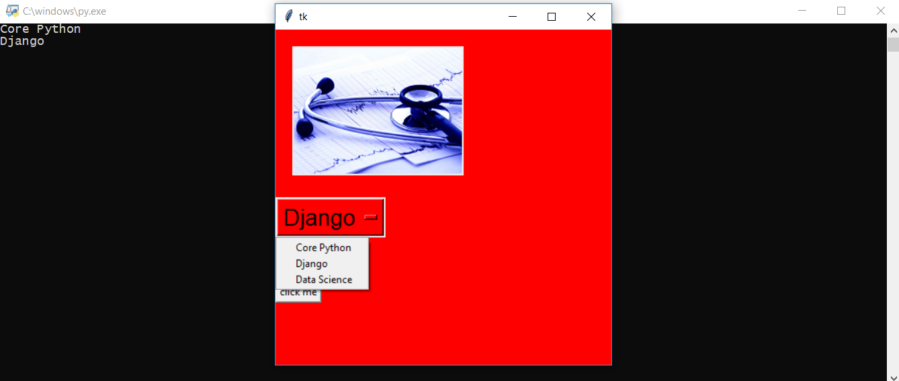
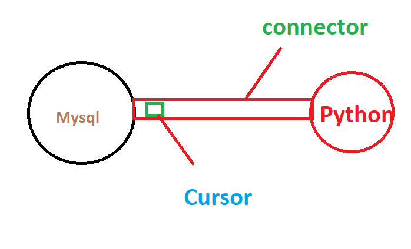
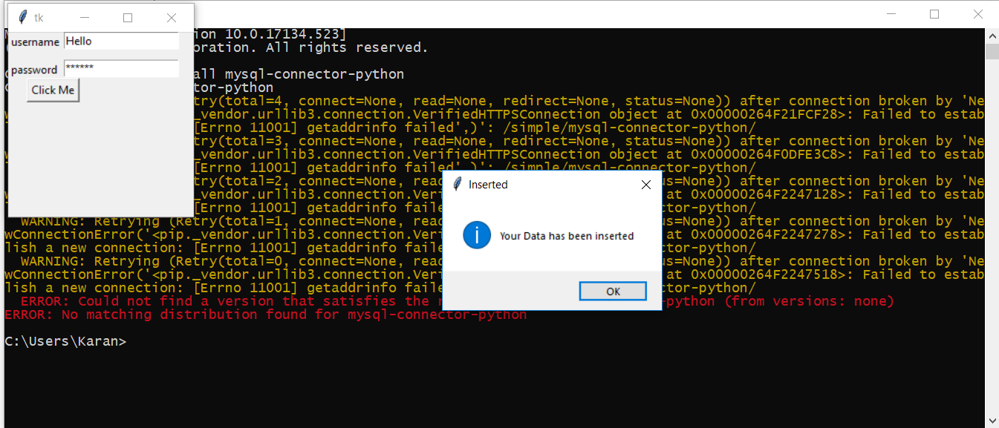

# pythontutorials
This tutorials is for o7 services 6 weeks batch

<h1>TkinterFirst</h1>
 

<b style="color:red"><kbd>first.py</kbd> It contains how to make windows and labels.It also contains some other stuffs like how
to change window size giving background,font and color to the label.</b> 
 

<b><kbd>second.py</kbd> It contains how to make a button and how to show a message box on click of the button</b>
 
 

<b><kbd>third.py</kbd> This will demonstrate about how to get and set text in entry with click of the button.</b>
 
 

<h1>TkinterSecond</h1>
 

<b style="color:red"><kbd>first.py</kbd> It contains how to set image on a label and how to use Option menu to restrict the inputs by the user.</b> 
 

<h1>TkinterInsert</h1>
 

Suppose we have two cities and we want to join those cities then we need a route similarly python and mysql are two cities and connector works like an api which is road now we want to transport the luggage between them so we need the car here cursor will act like a car and luggage will be insert inside the cursor.So the luggage is the queries which you execute in the mysql.
when you send the data from python to mysql you need to commit the query to confirm it like we make a phone call after the arrival of the luggage.
 
<b style="color:red"><kbd>hello.py</kbd> It contains how to insert data into the databse.</b> 
 
