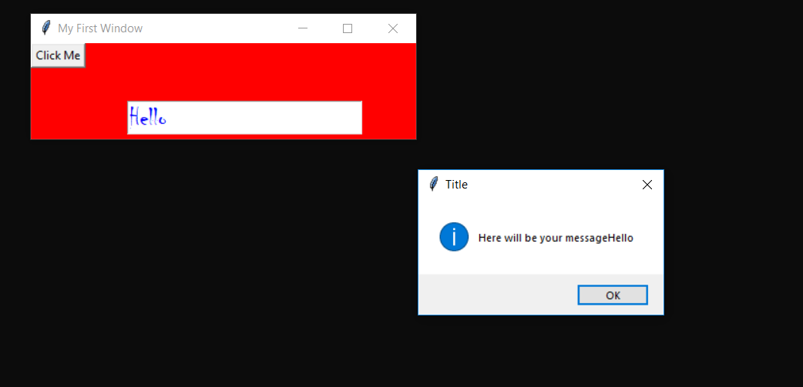

# pythontutorials
This tutorials is for o7 services 6 weeks batch

<h1>TkinterFirst</h1>
 

<b style="color:red"><kbd>first.py</kbd> It contains how to make windows and labels.It also contains some other stuffs like how
to change window size giving background,font and color to the label.</b> 
 

<b><kbd>second.py</kbd> It contains how to make a button and how to show a message box on click of the button</b>
 
 

<b><kbd>third.py</kbd> This will demonstrate about how to get and set text in entry with click of the button.</b>
 
 
