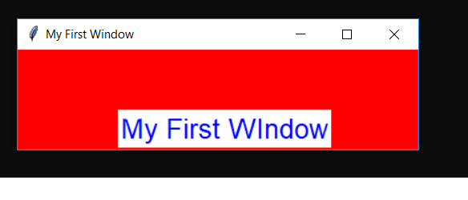
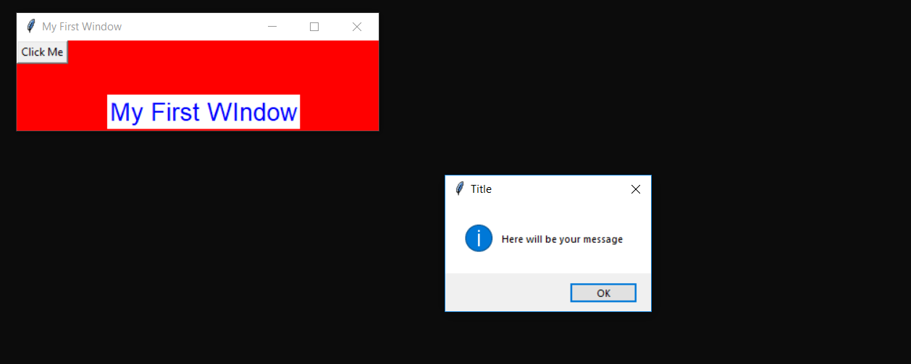

# pythontutorials
This tutorials is for o7 services 6 weeks batch

<h1>TkinterFirst</h1>
 
<b><u>1.</u>It contains how to make windows and labels.It also contains some other stuffs like how
to change window size giving background,font and color to the label.</b> 
 
<b><u>2.</u>It contains how to make a button and how to show a message box on click of the button</b>
 

